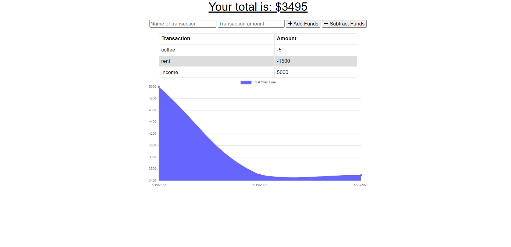

<h1 align="center"> Budget Tracker </h1>

<h3 align="center"> by Christan Fox </h3>
  
<p align="center">
    
    
    
    <a href="https://github.com/ChristanFox"></a>
    <a href="https://twitter.com/ChristanFox">
        
    </a>
</p>

## Table of Contents

- [Description](#description)
- [Screenshot](#screenshot)
- [Requirements](#requirements)
- [Contact Me](#contact-me)
- [Deployment](#deployment)
- [Testing](#testing)

## Description

This API is for the avid traveler for when they want to be able to track my withdrawals and deposits with or without a data/internet connection so that their account balance is accurate when traveling.

## Screenshot



## Requirements

- 
- 
- 
- 

## Contact Me

- Christan Fox
- [Email](christanfox@gmail.com)
- [Github](https://github.com/christanfox/)

## Deployment

- [Heroku](https://budget-tracker-cfox.herokuapp.com/)

## Testing

```
npm start
```
